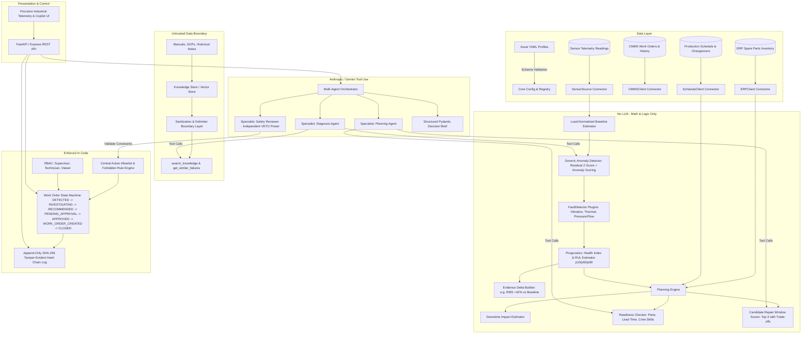

# MaintainCopilot System Architecture

## Core Subsystems
1. **Asset Profiles (`assets/profiles/`)**: Machine specifications with sensor normal ranges, sampling rates, derived features, failure modes, criticality classes, and reference manuals.
2. **Deterministic Processing (`detectors/`, `prognostics/`, `planning/`)**: Computes quantitative metrics without hallucination risk.
3. **Knowledge Retrieval (`knowledge/`)**: Strips command instructions, treats all technical manuals as untrusted DATA, wraps outputs in strict XML/markdown delimiters.
4. **Governance (`governance/`)**: The human supervisor is the single point of authority for state transition into APPROVED and WORK_ORDER_CREATED. Shuts downs and overrides are hard-blocked for AI agents.
5. **Multi-Agent Orchestrator (`agents/`)**: Executes structured tool calls, generates reasoning traces, and subjects briefs to an independent Safety Reviewer veto.
6. **Audit & Traceability (`governance/audit.py`)**: Every input, tool call, model version, and human decision forms an immutable hash-chained block.
